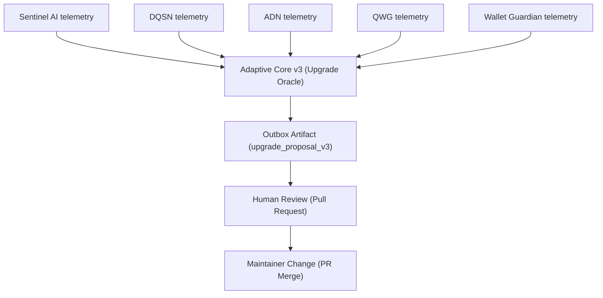

## DigiByte Adaptive Core (v3.1.0)


**Adaptive Core v3.1.0** is the package baseline for the deterministic Upgrade
Oracle in the DigiByte Quantum Shield v4 ecosystem.

V4.10-G2 aligns package metadata from `3.0.0` to the existing `v3.1.0` tag
and README. The later working tree is not the historical tagged snapshot.
This metadata/documentation/test candidate declares no new release or tag.
See [release status](docs/RELEASE_STATUS_V4_10_G2.md) for exact source and test
evidence, the frozen exporter-version distinction, and post-commit gates.

It is a read-only, deterministic, fail-closed advisory system that
observes shield signals, derives evidence and findings, and produces
structured governance artifacts for human review.

> Adaptive Core v3 observes, summarizes, and proposes.\
> It never executes transactions, modifies wallet or node state, or self-upgrades.

Read-only describes the external authority boundary. Local evidence counters
and explicit report/proposal artifact emission are supported; it does not mean
the implementation has no local state or file output.

------------------------------------------------------------------------

## Core Properties

-   Read-only / advisory only
-   Deterministic & replayable
-   Fail-closed (no silent defaults)
-   Human-reviewed governance artifacts
-   No authority over keys, transactions, or nodes
-   No Shield signature verification or Shield trust registry
-   Strict contract enforcement
-   Aligned with Archangel Michael Guardrails

------------------------------------------------------------------------

## Role in the DigiByte Quantum Shield


``` mermaid
flowchart TB
  Sentinel["Sentinel AI telemetry"]
  DQSN["DQSN telemetry"]
  ADN["ADN telemetry"]
  QWG["QWG telemetry"]
  GW["Wallet Guardian telemetry"]

  AC["Adaptive Core v3 (Upgrade Oracle)"]
  Outbox["Outbox Artifact (upgrade_proposal_v3)"]
  HR["Human Review (Pull Request)"]
  Apply["Maintainer Change (PR Merge)"]

  Sentinel --> AC
  DQSN --> AC
  ADN --> AC
  QWG --> AC
  GW --> AC

  AC --> Outbox --> HR --> Apply
```

------------------------------------------------------------------------

## Shield v4 Compatibility Boundary

Adaptive Core accepts advisory observations and emits advisory artifacts. It does not parse or verify Shield signature bundles, possess Shield decision-evidence keys, or interpret cryptographic evidence as approval.

The Shield verifier-required policy remains `classical-ed25519 + ml-dsa`. Optional `fn-dsa` evidence uses Falcon-1024 under `fips206-draft-falcon1024-v1`; it is draft-profile evidence, not final FIPS 206 proof. Adaptive Core cannot make FN-DSA required or use it to replace, rescue, override, or downgrade a required verification result.

Q-ID identity keys and Shield decision-evidence keys remain separate. AdamantineOS independently verifies Shield evidence and remains the authoritative, fail-closed final policy and execution boundary.

`classical_signature` and `pqc_signature` contain caller-supplied status
metadata (`ABSENT`, `PRESENT`, `UNSUPPORTED`), not signature bytes. A report
hash or a `PRESENT` label does not establish authorship, provenance, verified
Shield proof, or permission to execute. Adaptive Core has no OQS workflow and
makes no live-OQS claim.

------------------------------------------------------------------------

## What Adaptive Core v3 Produces

-   Canonicalized observations (strict schema)
-   Deterministic evidence counters (hot-window model)
-   Deterministic findings & drift indicators
-   Human-readable upgrade reports (JSON + Markdown)
-   Integrity envelopes (`report_hash` plus local `classical_signature` and `pqc_signature` status metadata)
-   Privacy-preserving cross-node summaries
-   Structured `upgrade_proposal_v3` governance artifacts

------------------------------------------------------------------------

## Governance Model (Human-Only Apply)

Adaptive Core may **propose** upgrades.

Only humans may **apply** upgrades.

Flow:

1.  ACv3 detects drift / pattern / confidence degradation.
2.  ACv3 builds and seals an `upgrade_proposal_v3` (deterministic hash).
3.  ACv3 optionally emits artifact into `proposals/outbox/`.
4.  A human opens a Pull Request to apply the actual change.
5.  CI + contract enforcement validate the change.

Adaptive Core:

-   Does not auto-merge
-   Does not auto-execute
-   Does not mutate code or configuration
-   Does not hold authority over execution boundaries

------------------------------------------------------------------------

## Upgrade Proposals Mailbox

The `proposals/` directory defines structured governance.

-   Schema: `proposals/schema/upgrade_proposal_v3.schema.json`
-   Deterministic canonical hash required
-   Guardrails validated at build time
-   Outbox emission is artifact-only (idempotent, fail-closed on
    collision)
-   All real changes require explicit human Pull Request

This enforces:

-   No hidden authority
-   No silent mutation
-   No autonomous evolution
-   Full auditability

------------------------------------------------------------------------

## What Adaptive Core v3 Does NOT Do

-   Execute transactions
-   Modify wallet or node state
-   Hold keys or secrets
-   Verify Shield signatures or select Shield trust keys
-   Auto-apply patches
-   Guess missing data
-   Perform black-box ML
-   Escalate authority beyond advisory role

------------------------------------------------------------------------

## Documentation

Authoritative documentation lives under:

docs/reports/v3/

Key documents include:

-   [Release status and version map](docs/RELEASE_STATUS_V4_10_G2.md)
-   [Changelog](CHANGELOG.md)
-   CONTRACT.md --- normative behavior contract
-   AUTHORITY_BOUNDARIES.md --- hard authority limits
-   ADAMANTINEOS_INTEGRATION.md --- advisory exporter and Shield v4 compatibility boundary
-   GUARDRAILS.md --- enforced guardrails registry
-   [`SECURITY.md`](SECURITY.md) --- repository security posture
-   REPORT_FORMAT.md --- report structure
-   PIPELINE_USAGE.md --- execution pipeline
-   NODE_SUMMARY.md --- cross-node aggregation
-   DRIFT_RADAR.md --- drift detection model
-   CORRELATION.md --- correlation logic
-   CONFIDENCE_MODEL.md --- confidence scoring
-   EVIDENCE_STORE.md --- evidence window semantics

If docs and code ever diverge, code + CONTRACT.md win.

------------------------------------------------------------------------

## Quality & Verification

-   CI enforced
-   100% statement coverage (coverage gate enforced)
-   Deterministic tests only
-   No silent fallback paths
-   Guardrails validated at runtime
-   Canonical hash invariant enforced

G2 candidate on CPython 3.11.15: **289 passed, zero skips, failures, or
errors; 1505/1505 statements covered**. Six G2 release-truth tests are included.
The 100% gate is statement coverage; branch coverage is not configured here.
These tests do not establish production security or Shield cryptographic proof.

```bash
python -m pip install -e ".[dev]"
python -c "from adaptive_core.v3.proposals import validate_inbox; validate_inbox()"
python -m pytest
```

The single `Adaptive Core Tests` workflow validates the proposal inbox and
runs the full suite. G2 still needs green CI on the complete upload commit
and a fresh post-commit ZIP; earlier source-commit CI does not close that gate.

The separate manual `Demo - Emit Upgrade Proposal` workflow produces a demo
artifact only. It is unchanged, is not standard CI or cryptographic proof,
and is not an additional G2 release gate.

Version surfaces are intentionally separated:

| Surface | G2 value and meaning |
|---|---|
| Package metadata / public baseline | `3.1.0` / existing `v3.1.0` tag |
| v3 report-document contract baseline | `v3.0.0`, unchanged |
| Advisory interface | `adaptive_core_oracle_v3`, unchanged |
| Exporter default `oracle_version` | `adaptive-core/3.0.0`, frozen compatibility metadata |

The exporter default is caller-overridable advisory metadata, not an installed
package-version query or an authenticated producer identity. Its exact shared
fixture remains unchanged. There is no runtime `__version__` or `server_version`
surface. G2 does not inherit Shield `v4.0.0` or assign a next release number.

------------------------------------------------------------------------

## Integration Model

Adaptive Core v3 is a deterministic advisory layer.

Execution boundaries (e.g., AdamantineOS) may:

1.  Consume sealed upgrade proposals.
2.  Require human review receipts.
3.  Enforce fail-closed decision boundaries.

Adaptive Core never pushes changes outward.
Its artifacts cannot approve, override, downgrade, bypass, or rescue a Shield result. AdamantineOS applies its own verifier-controlled policy and remains final.

------------------------------------------------------------------------

## Contributing

See CONTRIBUTING.md.

All contributions must:

-   Preserve determinism
-   Preserve explainability
-   Preserve authority boundaries
-   Include tests
-   Maintain 100% coverage

------------------------------------------------------------------------

## License

MIT License Copyright (c) DarekDGB
