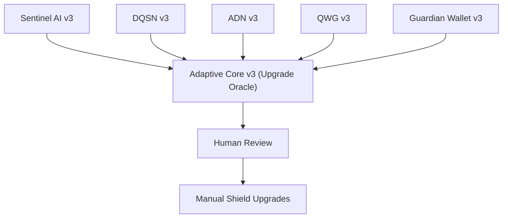

DigiByte Adaptive Core (v3.0.0)

**Adaptive Core v3.0.0** is the deterministic Upgrade Oracle of the
DigiByte Quantum Shield.

It is a read-only, deterministic, fail-closed advisory system that
observes shield signals, derives evidence and findings, and produces
human-reviewed upgrade reports.

> Adaptive Core v3 observes, summarizes, and reports.\
> It never executes, never modifies state, and never self-upgrades.

------------------------------------------------------------------------

## 🔐 Core Properties

-   Read-only / advisory only
-   Deterministic & replayable
-   Fail-closed (no silent defaults)
-   Human-reviewed outputs
-   No authority over keys, transactions, or nodes
-   Aligned with Archangel Michael Guardrails

------------------------------------------------------------------------

## 🧩 Role in the DigiByte Quantum Shield

``` mermaid
flowchart TB
  Sentinel["Sentinel AI v3"]
  DQSN["DQSN v3"]
  ADN["ADN v3"]
  QWG["QWG v3"]
  GW["Guardian Wallet v3"]

  AC["Adaptive Core v3 (Upgrade Oracle)"]
  HR["Human Review"]
  Up["Manual Shield Upgrades"]

  Sentinel --> AC
  DQSN --> AC
  ADN --> AC
  QWG --> AC
  GW --> AC

  AC --> HR --> Up
```

------------------------------------------------------------------------

## 📦 What Adaptive Core v3 Produces

-   Canonicalized observations (strict schema)
-   Deterministic evidence counters (hot-window)
-   Deterministic findings & drift indicators
-   Human-readable upgrade reports (JSON + Markdown)
-   Integrity envelopes (hash + signature status)
-   Privacy-preserving cross-node summaries
-   Structured upgrade proposals (v3 schema)

------------------------------------------------------------------------

## 📥 Upgrade Proposals Mailbox

Adaptive Core v3 introduces a structured `proposals/` mailbox.

-   All upgrade proposals must conform to:
    `proposals/schema/upgrade_proposal_v3.schema.json`
-   Proposals are submitted via Pull Request.
-   No automatic upgrades are ever applied.
-   All proposals require explicit human review.

This enforces:

-   No hidden authority
-   No silent mutation
-   No autonomous evolution
-   Full auditability

------------------------------------------------------------------------

## 🚫 What Adaptive Core v3 Does NOT Do

-   Execute transactions
-   Modify wallet or node state
-   Hold keys or secrets
-   Auto-apply patches
-   Guess missing data
-   Perform black-box ML

------------------------------------------------------------------------

## 📚 Documentation

All authoritative documentation lives under:

docs/reports/v3/

Key documents include:

-   README.md --- v3 overview
-   INDEX.md --- documentation index
-   CONTRACT.md --- normative behavior contract
-   AUTHORITY_BOUNDARIES.md --- hard authority limits
-   GUARDRAILS.md --- enforced guardrails registry
-   SECURITY.md --- security posture & disclosure
-   REPORT_FORMAT.md --- report structure
-   PIPELINE_USAGE.md --- execution pipeline
-   NODE_SUMMARY.md --- cross-node aggregation
-   DRIFT_RADAR.md --- drift detection model
-   CORRELATION.md --- correlation logic
-   CONFIDENCE_MODEL.md --- confidence scoring
-   EVIDENCE_STORE.md --- evidence window semantics

If docs and code ever diverge, code + CONTRACT.md wins.

------------------------------------------------------------------------

## 🧪 Quality & Verification

-   CI enforced
-   100% test coverage (coverage gate enforced in CI)
-   Deterministic tests only
-   No silent fallback paths
-   All guardrails validated at runtime

------------------------------------------------------------------------

## 🔗 Integration Model

Adaptive Core v3 acts as a deterministic advisory layer.

External systems (e.g., execution boundaries such as AdamantineOS) may:

1.  Generate structured upgrade proposals.
2.  Submit them to the Adaptive Core `proposals/` mailbox.
3.  Undergo human review before any shield changes occur.

Adaptive Core never pushes changes outward.

------------------------------------------------------------------------

## 🤝 Contributing

See CONTRIBUTING.md.

All contributions must:

-   Preserve determinism
-   Preserve explainability
-   Preserve authority boundaries
-   Include tests
-   Maintain 100% coverage

------------------------------------------------------------------------

## 📝 License

MIT License © DarekDGB
