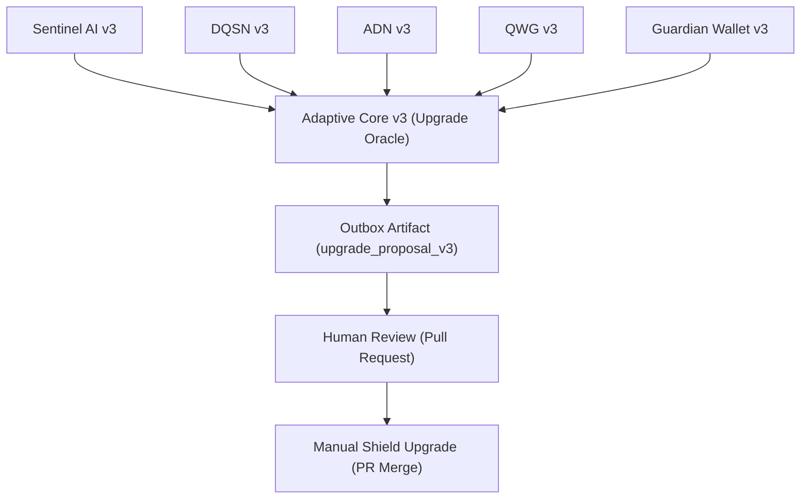

## DigiByte Adaptive Core (v3.1.0)

**Adaptive Core v3.1.0** is the deterministic Upgrade Oracle of the
DigiByte Quantum Shield.

It is a read-only, deterministic, fail-closed advisory system that
observes shield signals, derives evidence and findings, and produces
structured governance artifacts for human review.

> Adaptive Core v3 observes, summarizes, and proposes.\
> It never executes, never modifies state, and never self-upgrades.

------------------------------------------------------------------------

## 🔐 Core Properties

-   Read-only / advisory only
-   Deterministic & replayable
-   Fail-closed (no silent defaults)
-   Human-reviewed governance artifacts
-   No authority over keys, transactions, or nodes
-   Strict contract enforcement
-   Aligned with Archangel Michael Guardrails

------------------------------------------------------------------------

## 🧩 Role in the DigiByte Quantum Shield

``` mermaid
flowchart TB
  Sentinel["Sentinel AI v3"]
  DQSN["DQSN v3"]
  ADN["ADN v3"]
  QWG["QWG v3"]
  GW["Guardian Wallet v3"]

  AC["Adaptive Core v3 (Upgrade Oracle)"]
  Outbox["Outbox Artifact (upgrade_proposal_v3)"]
  HR["Human Review (Pull Request)"]
  Apply["Manual Shield Upgrade (PR Merge)"]

  Sentinel --> AC
  DQSN --> AC
  ADN --> AC
  QWG --> AC
  GW --> AC

  AC --> Outbox --> HR --> Apply
```

------------------------------------------------------------------------

## 📦 What Adaptive Core v3 Produces

-   Canonicalized observations (strict schema)
-   Deterministic evidence counters (hot-window model)
-   Deterministic findings & drift indicators
-   Human-readable upgrade reports (JSON + Markdown)
-   Integrity envelopes (hash + signature status)
-   Privacy-preserving cross-node summaries
-   Structured `upgrade_proposal_v3` governance artifacts

------------------------------------------------------------------------

## 📤 Governance Model (Human-Only Apply)

Adaptive Core may **propose** upgrades.

Only humans may **apply** upgrades.

Flow:

1.  ACv3 detects drift / pattern / confidence degradation.
2.  ACv3 builds and seals an `upgrade_proposal_v3` (deterministic hash).
3.  ACv3 optionally emits artifact into `proposals/outbox/`.
4.  A human opens a Pull Request to apply the actual change.
5.  CI + contract enforcement validate the change.

Adaptive Core:

-   Does not auto-merge
-   Does not auto-execute
-   Does not mutate code or configuration
-   Does not hold authority over execution boundaries

------------------------------------------------------------------------

## 📥 Upgrade Proposals Mailbox

The `proposals/` directory defines structured governance.

-   Schema: `proposals/schema/upgrade_proposal_v3.schema.json`
-   Deterministic canonical hash required
-   Guardrails validated at build time
-   Outbox emission is artifact-only (idempotent, fail-closed on
    collision)
-   All real changes require explicit human Pull Request

This enforces:

-   No hidden authority
-   No silent mutation
-   No autonomous evolution
-   Full auditability

------------------------------------------------------------------------

## 🚫 What Adaptive Core v3 Does NOT Do

-   Execute transactions
-   Modify wallet or node state
-   Hold keys or secrets
-   Auto-apply patches
-   Guess missing data
-   Perform black-box ML
-   Escalate authority beyond advisory role

------------------------------------------------------------------------

## 📚 Documentation

Authoritative documentation lives under:

docs/reports/v3/

Key documents include:

-   CONTRACT.md --- normative behavior contract
-   AUTHORITY_BOUNDARIES.md --- hard authority limits
-   GUARDRAILS.md --- enforced guardrails registry
-   SECURITY.md --- security posture
-   REPORT_FORMAT.md --- report structure
-   PIPELINE_USAGE.md --- execution pipeline
-   NODE_SUMMARY.md --- cross-node aggregation
-   DRIFT_RADAR.md --- drift detection model
-   CORRELATION.md --- correlation logic
-   CONFIDENCE_MODEL.md --- confidence scoring
-   EVIDENCE_STORE.md --- evidence window semantics

If docs and code ever diverge, code + CONTRACT.md win.

------------------------------------------------------------------------

## 🧪 Quality & Verification

-   CI enforced
-   100% test coverage (coverage gate enforced)
-   Deterministic tests only
-   No silent fallback paths
-   Guardrails validated at runtime
-   Canonical hash invariant enforced

------------------------------------------------------------------------

## 🔗 Integration Model

Adaptive Core v3 is a deterministic advisory layer.

Execution boundaries (e.g., AdamantineOS) may:

1.  Consume sealed upgrade proposals.
2.  Require human review receipts.
3.  Enforce fail-closed decision boundaries.

Adaptive Core never pushes changes outward.

------------------------------------------------------------------------

## 🤝 Contributing

See CONTRIBUTING.md.

All contributions must:

-   Preserve determinism
-   Preserve explainability
-   Preserve authority boundaries
-   Include tests
-   Maintain 100% coverage

------------------------------------------------------------------------

## 📝 License

MIT License © DarekDGB
