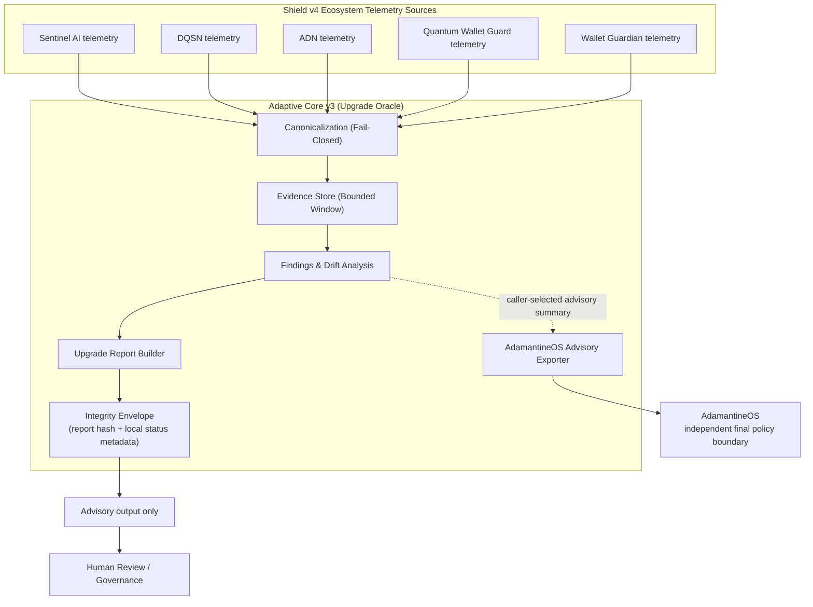

# Adaptive Core v3 — Architecture Overview

This document describes the **current architecture** of Adaptive Core v3
within the DigiByte Quantum Shield.

Adaptive Core v3 is a **read-only Upgrade Oracle**.
It observes, analyzes, and reports — it never executes actions.

---

## High-Level Architecture

```mermaid
flowchart TD

    subgraph ShieldLayers["Shield v4 Ecosystem Telemetry Sources"]
        Sentinel["Sentinel AI telemetry"]
        DQSN["DQSN telemetry"]
        ADN["ADN telemetry"]
        QWG["Quantum Wallet Guard telemetry"]
        Guardian["Wallet Guardian telemetry"]
    end

    subgraph AdaptiveCore["Adaptive Core v3 (Upgrade Oracle)"]
        Canon["Canonicalization (Fail-Closed)"]
        Evidence["Evidence Store (Bounded Window)"]
        Findings["Findings & Drift Analysis"]
        Report["Upgrade Report Builder"]
        Envelope["Integrity Envelope\n(report hash + local status metadata)"]
        Exporter["AdamantineOS Advisory Exporter"]
    end

    Sentinel --> Canon
    DQSN --> Canon
    ADN --> Canon
    QWG --> Canon
    Guardian --> Canon

    Canon --> Evidence
    Evidence --> Findings
    Findings --> Report
    Report --> Envelope
    Findings -.->|caller-selected advisory summary| Exporter

    Envelope --> Advisory["Advisory output only"]
    Advisory --> Human["Human Review / Governance"]
    Exporter --> AOS["AdamantineOS\nindependent final policy boundary"]
```

---

## Architectural Invariants

- **Read-only**: No component of Adaptive Core can modify shield layers
- **Deterministic**: Same inputs always produce the same report
- **Fail-closed**: Invalid or malformed input is rejected
- **No execution authority**: Reports are advisory only
- **No Shield verification**: Adaptive Core does not parse signature bundles or select Shield keys
- **Externally governed**: Adaptive Core never makes final decisions
- **Final boundary**: AdamantineOS remains authoritative over any consumed advisory evidence

---

## Explicit Non-Features

Adaptive Core v3 does **not**:
- execute transactions
- alter wallet or node state
- auto-apply upgrades
- silently accept malformed input
- influence consensus or networking logic
- approve, override, downgrade, bypass, or rescue Shield evidence

---

## Canonical Authority

If documentation or diagrams conflict with implementation, **code +
CONTRACT.md win**.
